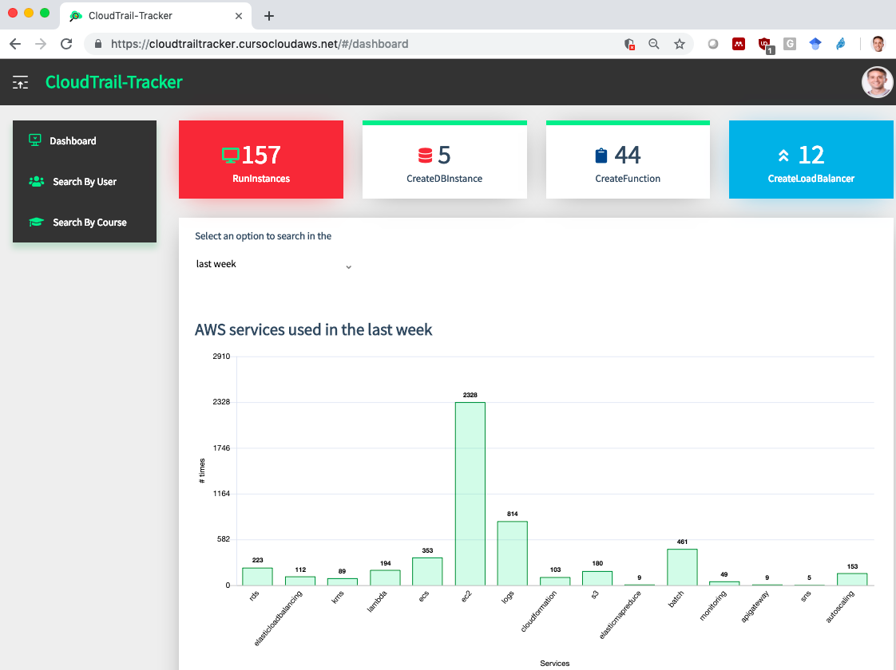
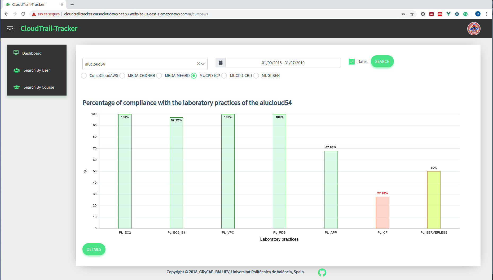
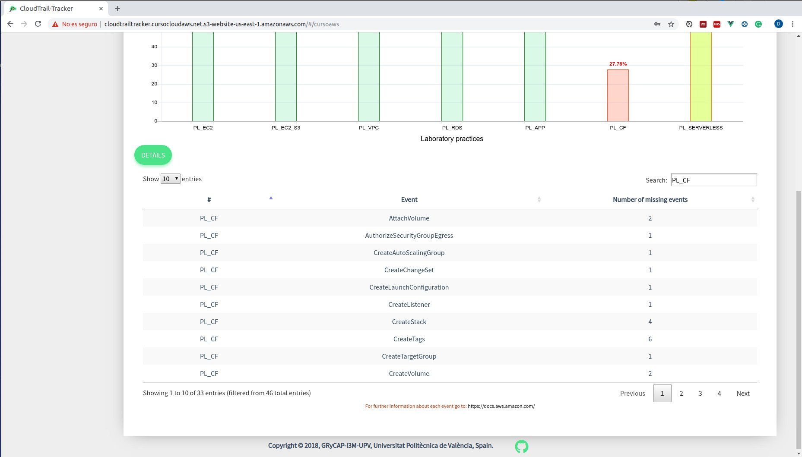

# CloudTrail-Tracker-UI 

CloudTrail-Tracker-UI is the web portal based on Vue.js that queries the REST API of [CloudTrail-Tracker](https://github.com/grycap/cloudtrail-tracker) to visually show the high-level aggregate information related to the use of resources in AWS by different users based on the events information.

## Visual Aspect of the Dashboard
The dashboard depicts an aggregated view of the AWS services usage in a pre-defined time frame: 


It also allows users to know their progress percentage across a set of lab activities. The set of events per lab activities are defined in [envprac.js](src/envprac.js). This is useful when applying this tool for the academic teaching of Cloud Computing with Amazon Web Services:


Clicking on each bar allows the user to know the missing events per lab activity 


An academic publication on the adoption of this tool as a learning dashboard for students is available in:

Naranjo, Diana M., José R. Prieto, Germán Moltó, and Amanda Calatrava. 2019. “A Visual Dashboard to Track Learning Analytics for Educational Cloud Computing.” Sensors 19(13): 2952. https://www.mdpi.com/1424-8220/19/13/2952/htm (July 4, 2019).

## Requirements

* An existing [Cognito User Pool](https://docs.aws.amazon.com/cognito/latest/developerguide/cognito-user-identity-pools.html) to store the  users, created in your AWS account.

* [npm](https://www.npmjs.com/) installed.

## Deployment

This is a static web application (HTML + CSS + JavaScript) and, therefore, it is expected to be deployed in an S3 bucket as this is the most secure, scalable and cost-effective approach.

1. Create a file named `src/env.js` (see example in `src/env_example.js`) specifying the corresponding values (obtained from the Cognito User Pool).
  
1. Modify the file `src/api.js` to define the API Gateway endpoint on which CloudTrail-Tracker is exposing its REST API.

1. Start a local server to verify the web application:
    ```sh
    npm run dev
    ```
    The web application will be available in `http://localhost:8080`

1. Create the static web site by issuing: 
    ```sh
    npm install
    npm run build
    ```
    The static web site will be available in the `dist` folder.

5. Upload the folder to an [S3 bucket with website configuration](https://docs.aws.amazon.com/AmazonS3/latest/dev/WebsiteHosting.html).


## Contributing

Before you contributing to this project, you should be familiar with [What is Amazon Cognito](http://docs.aws.amazon.com/cognito/latest/developerguide/what-is-amazon-cognito.html) and [Vue.js](https://vuejs.org/)
